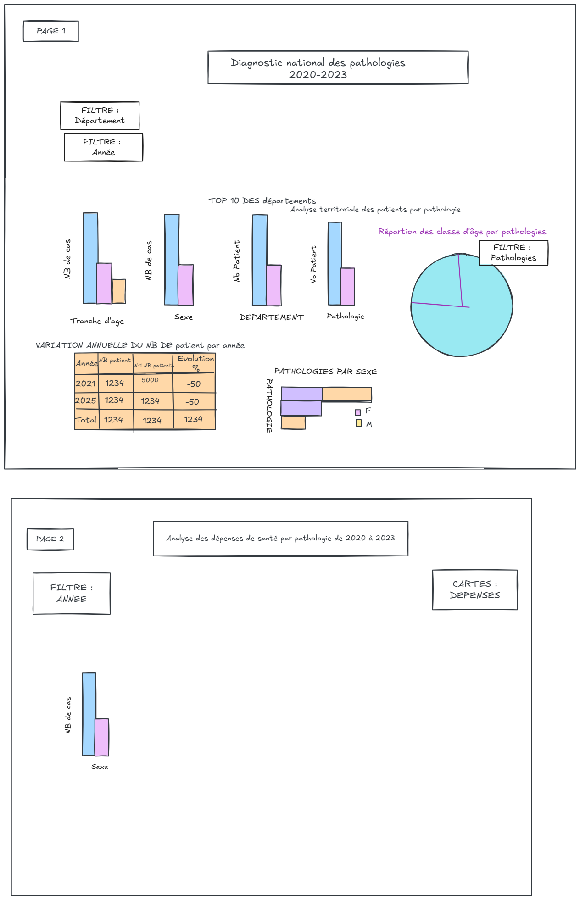

# PROJET_MEYTE
# Contexte
L'Assurance Maladie finance une cinquantaine de pathologies **67,4 millions de bénéficiaires** en France et traitements chroniques avec des budgets très disparates.
Cependant, un même nombre de patients pris en charge ne coûte pas pareil selon la pathologie : le diabète peut être peu coûteux en moyenne par patient, tandis qu'un cancer coûte beaucoup plus cher. Certaines pathologies consomment une part très importante du budget malgré une faible prévalence, tandis que d'autres concernent un grand nombre de patients tout en générant des coûts faibles.

# Dictionnaire du jeu de données
Le projet s'appuie sur les données de l'Assurance Maladie.
Il s'appuie sur deux datasets :
Les données proviennent du portail Open Data de l'Assurance Maladie.

[Dataset 1 – Effectifs de patients](https://data.ameli.fr/explore/dataset/effectifs/information/)

Ce jeu de données recense les effectifs de patients pris en charge par pathologie selon :
- l’année  
- le sexe  
- la classe d’âge  
- la région  
- le département  

[Dataset 2 – Dépenses remboursées](https://data.ameli.fr/explore/dataset/depenses/information/)

Ce jeu de données recense les dépenses remboursées associées aux pathologies selon :

- les dépenses totales ;
- les dépenses moyennes par patient ;
- les postes de dépenses ;

## Objectif
L'objectif de ce projet est de concevoir un système de reporting automatisé capable mieux comprendre comment les ressources de santé sont consommées selon les pathologies, les territoires et les profils de patients. Il combine deux niveaux d’analyse complémentaires :  
– une vue nationale des dépenses de santé par pathologie (2022–2023),
– une vue régionale et départementale des effectifs de patients.

L’outil développé permet ainsi d’identifier les pathologies les plus coûteuses, d’observer les disparités régionales et départementales, et de suivre l’évolution des dépenses dans le temps. 
L'analyse de ces indicateurs permet de mettre en évidence les principaux postes de dépenses, les populations les plus concernées,etc...

## Les formules que je prévois d’utiliser

Je prévois d’utiliser plusieurs formules afin de structurer, croiser et analyser les données

Je prévois d’utiliser :

* **Formules d’agrégation :** `SOMME()`, pour calculer les dépenses totales
* **Formules conditionnelles :** `NB.SI()`, `NB.SI.ENS()`, `SOMME.SI()`, `SOMME.SI.ENS()` pour filtrer et agréger les données selon la pathologie, la région, le sexe ou l’année
* **Analyse dynamique :** `FILTRER()` pour extraire et structurer des sous-ensembles de données selon différents critères (année, pathologie, tranches d'ages, postes de depenses)
* **Indicateurs de performance :** calcul du coût moyen par patient, des parts de dépenses par pathologie et des évolutions dans le temps
* **Gestion des erreurs et qualité des données :** `SI()`, `SIERREUR()` et `ARRONDI()` pour sécuriser et fiabiliser les calculs

# Schema 
!()
