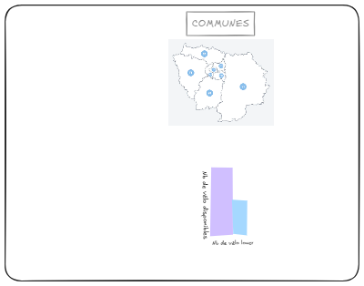

# PROJET_MEYTE
# Contexte
Le réseau Vélib' Métropole souffre d'une disponibilité asymétrique : de nombreuses stations sont saturées tandis que d'autres sont vides. Ce projet transforme les données brutes de l'API en informations actionnables pour identifier les zones de pénurie et de surstock. L'outil fournit une aide au rééquilibrage (dispatching) pour garantir un accès équitable au transport sur les 55 communes de la métropole.
# Dictionnaire du jeu de données
Le projet s'appuie sur les données du réseau Vélib’Métropole, le plus grand service de vélos partagés au monde en temps réel
Nous travaillons sur les données de velibs Vélib’ Métropole, ce sont près de 1 400 stations réparties sur 55 communes en Métropole et près de 400 km² desservis, soit le plus grand service de vélos partagés au monde incluant des vélos électriques rechargeables en station.
Les données mises à disposition sont des données de type dynamique permettant de suivre l’évolution du service en temps réel. Le moment de la dernière mise à jour est renseigné dans chaque base.
Ces données Nous permettront de connaître en temps réel le nombre de vélos mécaniques/électriques à chaque station ainsi que le nombre de bornettes libres.
# Données :
Les données sont disponibles sur le site data.gouv.fr au lien suivant :  # Source des données :
Les données sont disponibles sur le site data.gouv.fr au lien suivant :  https://opendata.paris.fr/explore/dataset/velib-emplacement-des-stations/ & https://opendata.paris.fr/explore/dataset/velib-disponibilite-en-temps-reel/
## Objectif
L'objectif de ce projet est de concevoir un système de reporting automatisé capable de transformer les flux de données bruts de la métropole parisienne en un tableau de bord décisionnel sur Excel et analyse les disparités entre les 55 communes et génère des indicateurs de performance (KPIs) pour piloter le dispatching des vélos mécaniques et électriques.
# Les formules que vous prévoyez d’utiliser
# Schema 
!()
